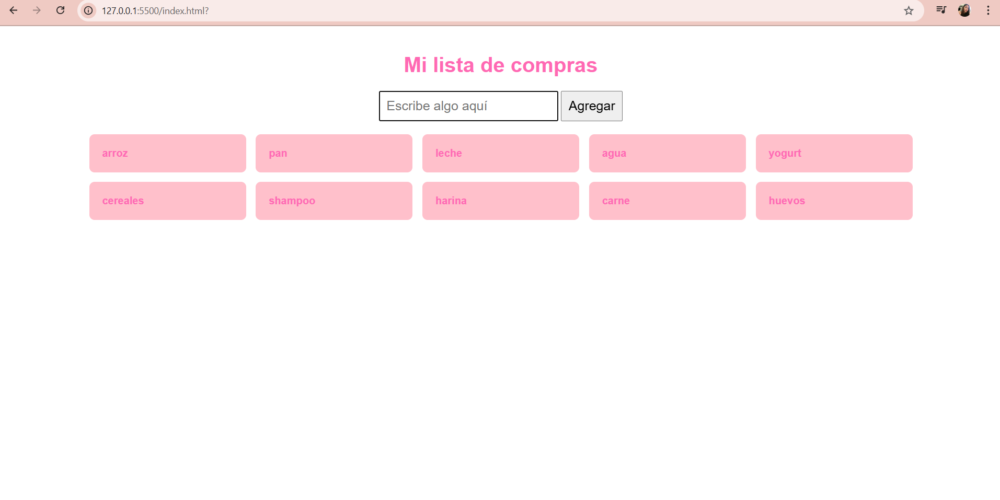

# Lista de Compras

Este proyecto es una aplicación sencilla hecha con HTML, CSS y JavaScript que permite al usuario escribir productos en un formulario e ir agregándolos como tarjetas a una lista de compras visual.

Cada vez que el usuario escribe un ítem en el campo de texto y presiona el botón "agregar", ese producto se suma a la lista y se muestra en pantalla.

## Funcionalidades

- Agregar productos a la lista de compras.
- Visualización en forma de tarjetas con estilo.
- Validación para evitar agregar elementos vacíos.

## Captura de pantalla

